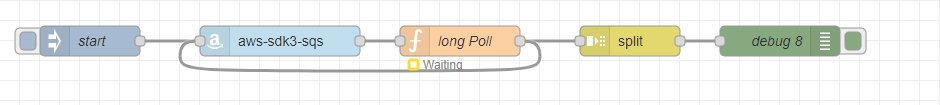

# node-reb-contrib-aws-sdk3-sqs

A node to manage SQS client class from **AWS SDK v3**.

The **aws-sdk3-sqs** node will set the **msg.AWS** and **msg.SQSClient** properties on the message.

**msg.AWS** is the direct import from **@aws-sdk/client-sqs**, while **msg.SQSClient** is an instance of SQSClient, created with **new AWS.SQSClient({region: *config node region*});**

### Example 
This flow gets an instance of AWS Sqs client, then, unsing a function node, starts an infinite long poll process.


```json

[{"id":"e9ca02d9f6bda427","type":"tab","label":"Flow 1","disabled":false,"info":"","env":[]},{"id":"eb9cb73d72b9607f","type":"aws-sdk3-sqs","z":"e9ca02d9f6bda427","name":"","server":"fcf3265905b5e64d","x":420,"y":200,"wires":[["97d88ffc2d8a8c20"]]},{"id":"97d88ffc2d8a8c20","type":"function","z":"e9ca02d9f6bda427","name":"long Poll","func":"const queueUrl =\"some-queue-url.fifo\";\n\nconst sqsClient = msg.SQSClient;\nconst AWS = msg.AWS;\n\nasync function longPollOneMessage(){\n    node.status({ fill: \"yellow\", shape: \"ring\", text: \"Waiting\" });\n\n    const command = new AWS.ReceiveMessageCommand({\n        AttributeNames: [\"SentTimestamp\"],\n        MaxNumberOfMessages: 1,\n        MessageAttributeNames: [\"All\"],\n        QueueUrl: queueUrl,\n        WaitTimeSeconds: 10,\n    });\n    const response = await sqsClient.send(command);\n\n    if (response.Messages) {\n\n        node.send({\n            payload: response.Messages.map(m => {\n                return JSON.parse(m.Body)\n            })\n        });\n\n\n        node.status({ fill: \"green\", shape: \"ring\", text: \"Received\" });\n\n        await sqsClient.send(\n            new AWS.DeleteMessageBatchCommand({\n                QueueUrl: queueUrl,\n                Entries: response.Messages.map((message) => ({\n                    Id: message.MessageId,\n                    ReceiptHandle: message.ReceiptHandle,\n                })),\n            })\n        );\n    }\n}\n\nlongPollOneMessage()\n    .catch(e => {\n        node.status({ fill: \"red\", shape: \"ring\" });\n        node.error(e)\n    })","outputs":1,"noerr":0,"initialize":"","finalize":"","libs":[],"x":600,"y":200,"wires":[["b4aa7c437549e93d","eb9cb73d72b9607f"]]},{"id":"b6374c63dbfaeaff","type":"inject","z":"e9ca02d9f6bda427","name":"start","props":[],"repeat":"","crontab":"","once":false,"onceDelay":0.1,"topic":"","x":230,"y":200,"wires":[["eb9cb73d72b9607f"]]},{"id":"70456293fdbb2f67","type":"debug","z":"e9ca02d9f6bda427","name":"debug 8","active":true,"tosidebar":true,"console":false,"tostatus":false,"complete":"false","statusVal":"","statusType":"auto","x":920,"y":200,"wires":[]},{"id":"b4aa7c437549e93d","type":"split","z":"e9ca02d9f6bda427","name":"","splt":"\\n","spltType":"str","arraySplt":1,"arraySpltType":"len","stream":false,"addname":"","x":770,"y":200,"wires":[["70456293fdbb2f67"]]},{"id":"fcf3265905b5e64d","type":"aws-sdk3-config","name":"AWS","region":"eu-west-1","proxyRequired":false,"proxy":""}]

```